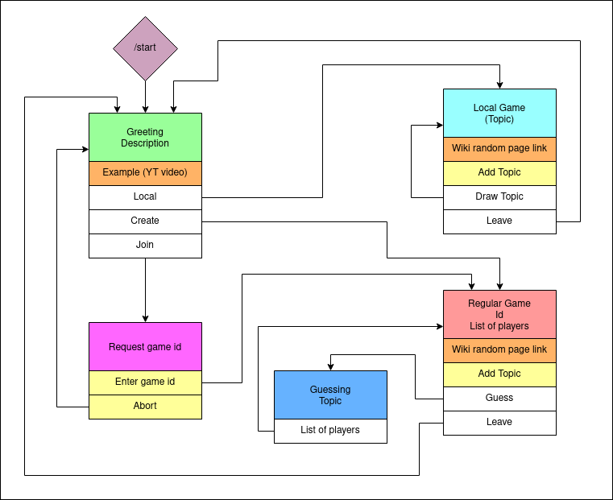

# SOTPAL

Hello and welcome to Some of These People are Lying!

This repository contains the game logic and a telegram bot interface.

The rules are simple: one player creates the game and sends the code for the others to join.
Everyone goes to a random wikipedia page, reads it,
and sends the page title to the bot. Guesser then presses
the guess button. The bot chooses the topic and sends it to everyone.
The person who read the topic tells what it was about,
others lie and try to convince the guesser that it was
them, who read the wiki. Guesser then tries to guess,
who is telling the truth.

Have fun!

## Game state machine

## Inspired by Tom Scott and Co

https://www.youtube.com/playlist?list=PLrkYtXgEpu5QXFgFJO8SxTMa24wv7b40X
